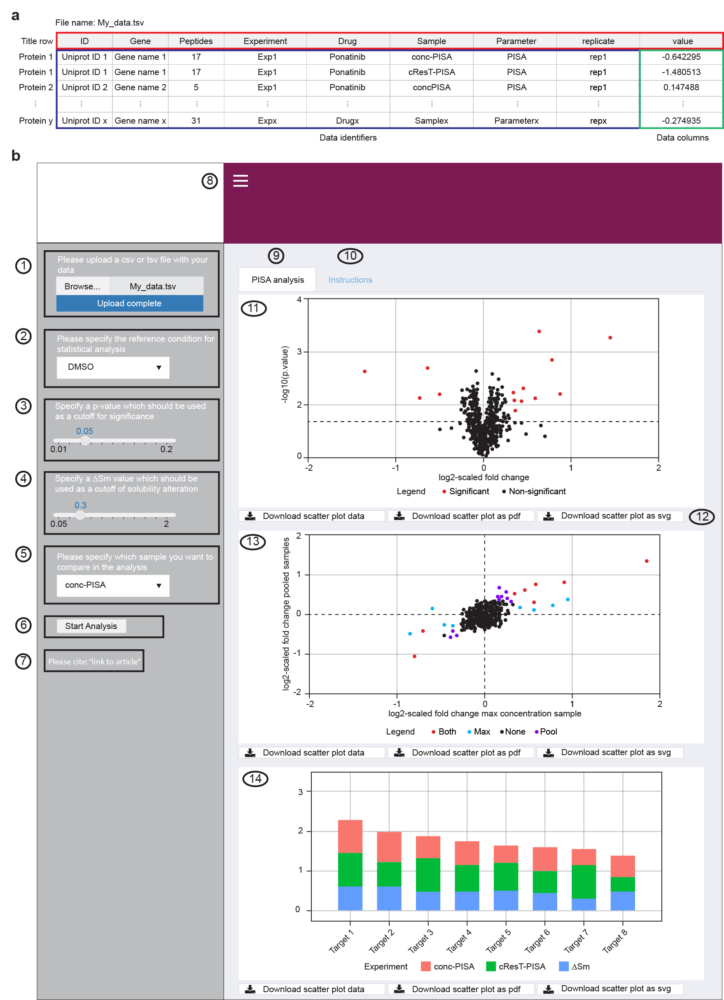

PISA-Analyzer
================

# Description
The PISA-Analyzer R package was developed as part of the 'System-wide profiling by proteome integral solubility alteration assay of drug residence times for target characterization' manuscript and provides an easy analysis platform to analyze PISA experiments. The supported experimental designed currenlty include either 1D, 2D (Solubility shift and Concentration or Residence time), 3D (Solubility shift and Concentration and Residence time) in a cellular lysate or 2D experiment in intact cells (as featured in Sabatier et al., 2021). The user is solely required to upload a .tsv file containing the quantitative results from their results with the appropriate annotation. PISA-Analyzer will provide figures in .pdf or .svg format as well as the source data as .tsv file.
For more information, please refer to the paper: <xx>


# System Requirements
## Hardware Requirements
The PISA-Analyzer package requires a standard office computer.

## Software Requirements
### OS Requirements
This package was developed under *Windows 10* running *R version 4.0.2* and was successfully tested also on *Mac OSX* and *Windows 8*.

### R Dependencies
The PISA-Analyzer package depends on the following R packages (with version):
```
shiny_1.7.1
shinydashboard_0.7.2
tidyverse_1.3.1
plotly_4.10.0
ggrepel_0.9.1
broom_0.8.0
shinycssloaders_1.0.0
```

# Installation Guide
Please install all necessary packages from CRAN which should take less than 1 min:
    
    install.packages(c('shiny', 'shinydashboard', 'tidyverse', 'plolty', 'ggrepel', 'broom', 'shinycssloaders'))  

Once all packages are installed, please start the PISA-Analyzer R Shiny with the following command:

    shiny::runGitHub('PISA_Analyzer', 'RZlab')

    
# Instructions
For the following experimental designs please make sure you have specified the following variables:
1D PISA: Paramter: [PISA]
ConPISA-PISA: Paramter: [PISA], Drug: [...Max, ...Pool], Sample: [conc-PISA]
ResT-PISA: Paramter: [PISA], Drug: [...Max, ...Pool], Sample: [cResT-PISA]
3D PISA: Paramter: [PISA], Drug: [...Max, ...Pool], Sample: [conc-PISA, cResT-PISA]
PISA-Express:  Paramter: [PISA, Exp], Sample: [PISA-Express]


For detailed instructions, please refer to the paper: <xx>




# License

This project is covered under the **Apache 2.0 License**.


